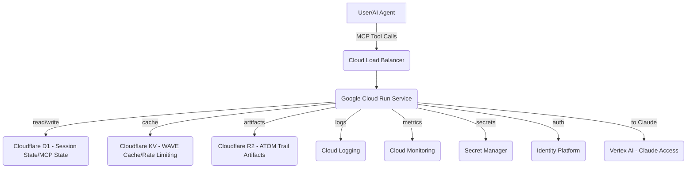
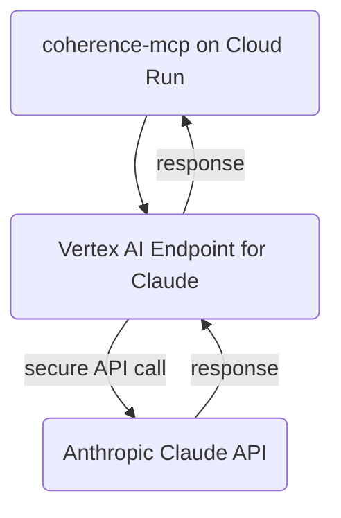

# 🚀 Enterprise Deployment Architecture for coherence-mcp

## Google Cloud Run, Vertex AI, and Australian Data Sovereignty

As the Gemini strand (Multimodal & Scale), this document outlines the production-grade deployment architecture for the `coherence-mcp` server, focusing on enterprise adoption, scalability, and adherence to regional data sovereignty requirements, particularly within the Australian context.

---

## 1. Google Cloud Run Deployment for coherence-mcp Server

Google Cloud Run provides a fully managed compute platform for deploying containerized applications. Its auto-scaling capabilities and pay-per-use model make it ideal for the `coherence-mcp` server, which may experience variable load from various AI agents and human operators.

### Architecture Overview

### Key Considerations for Cloud Run

*   **Containerization:** The `coherence-mcp` server (`build/index.js`) will be containerized using a `Dockerfile`. This ensures a consistent runtime environment.
*   **Auto-scaling:** Cloud Run automatically scales instances up or down based on request traffic, ensuring high availability and cost efficiency. Configuration will include:
    *   `min-instances`: 0 (for cost-saving during idle periods) or 1 (for rapid cold-start response).
    *   `max-instances`: Configured based on anticipated peak load and budget.
    *   `cpu-throttling`: Disabled for latency-sensitive tasks.
*   **Concurrency:** Set to a suitable value (e.g., 80-100 requests per instance) to optimize resource utilization.
*   **Environment Variables:** Critical configurations (e.g., API keys, external service URLs) will be managed via Google Cloud Secret Manager and injected as environment variables into Cloud Run services.
*   **Health Checks:** Configure `/health` endpoints to ensure instances are serving traffic correctly.
*   **Networking:** Private ingress to ensure only authorized traffic reaches the service, potentially via Cloud Load Balancing and VPC Service Controls.

---

## 2. Vertex AI Integration for Claude Access from Google Ecosystem

While Claude is a separate AI platform (Anthropic), `coherence-mcp` requires interaction with Claude (as the Structure & Reasoning strand) for tasks like code analysis, architectural coherence checks, and specific tool invocations. Integrating via Google Cloud's Vertex AI provides a consistent, secure, and scalable way to access external models.

### Integration Strategy

### Benefits of Vertex AI Integration

*   **Unified API Gateway:** Vertex AI can act as a proxy for external models, providing a single endpoint for `coherence-mcp` to interact with Claude, abstracting away direct API calls to Anthropic.
*   **Security:** Leverage Google Cloud's robust IAM for access control to the Vertex AI endpoint, and potentially integrate with VPC Service Controls for private access if available for external models.
*   **Monitoring & Logging:** Centralized monitoring and logging of Claude interactions within Cloud Monitoring and Cloud Logging.
*   **Rate Limiting/Quota Management:** Vertex AI can enforce rate limits and quotas for Claude API usage, protecting against overuse.
*   **Data Handling:** Ensure data passed to Claude is handled according to enterprise policies, with options for data residency controls where feasible.

---

## 3. Scaling Patterns for Enterprise Adoption

Enterprise adoption of `coherence-mcp` necessitates robust scaling strategies that handle increased load, diverse use cases, and complex data flows while maintaining performance and reliability.

*   **Decoupled Architecture:** `coherence-mcp` operates as a stateless or near-stateless service on Cloud Run, offloading state management to external, scalable services (Cloudflare D1, KV, R2). This allows for independent scaling of compute and storage.
*   **Asynchronous Processing:** For long-running coherence analyses or complex ATOM Trail operations, integrate with Google Cloud Tasks or Pub/Sub to offload work to background workers (e.g., separate Cloud Run services or Cloud Functions) that can scale independently.
*   **Global Load Balancing (GCLB):** For geographically distributed users, GCLB can distribute traffic to Cloud Run services deployed in multiple regions, minimizing latency and providing regional failover.
*   **Caching Strategy:** Cloudflare KV serves as a distributed cache for frequently accessed WAVE scores, ATOM Trail metadata, and configuration, reducing direct database reads and improving response times.
*   **Observability:** Implement comprehensive logging, monitoring, and tracing using Cloud Logging, Cloud Monitoring, and Cloud Trace to identify performance bottlenecks and ensure proactive issue resolution.
*   **Cost Optimization:** Leverage Cloud Run's auto-scaling, set appropriate concurrency limits, and utilize reserved instances for predictable baseline loads to optimize costs.

---

## 4. Australian Data Sovereignty Considerations (Sydney Region)

For enterprise clients in Australia, adhering to data sovereignty requirements is paramount. Google Cloud provides a Sydney region (`australia-southeast1`) that can be leveraged to ensure data remains within Australian borders.

### Strategy for Data Residency

*   **Google Cloud Region Selection:** Deploy all Google Cloud resources (Cloud Run services, Cloud Logging, Cloud Monitoring, Secret Manager, Identity Platform) within the `australia-southeast1` region.
*   **Cloudflare Data Residency:** Cloudflare, as a global CDN and edge compute platform, offers data localization options. Configure Cloudflare D1, KV, and R2 to store data in Australian data centers where available and compliant with local regulations.
    *   **D1:** Configure D1 databases to be located in the closest Australian data centers.
    *   **KV:** Utilize KV namespaces configured for Australian data residency.
    *   **R2:** Store ATOM Trail artifacts in R2 buckets configured for Australian data residency.
*   **Data Classification and Encryption:** Implement strict data classification policies. All data at rest will be encrypted using Google-managed or customer-managed encryption keys. Data in transit will be secured using TLS 1.2+.
*   **Access Controls:** Implement strict IAM policies, ensuring only authorized personnel and services within Australia can access sensitive data.
*   **Auditing and Compliance:** Maintain comprehensive audit logs (in Cloud Logging, configured for Australian residency) to demonstrate compliance with relevant Australian regulations (e.g., Privacy Act 1988, APPs).
*   **External Service Review:** Ensure that any integrated third-party services (e.g., Anthropic Claude API via Vertex AI) also comply with data sovereignty requirements or implement compensating controls to protect Australian data. This might involve contractual agreements or data anonymization/pseudonymization strategies.

---

## Conclusion

This deployment architecture for `coherence-mcp` on Google Cloud, integrated with Cloudflare's edge services and Vertex AI, is designed to meet the rigorous demands of enterprise adoption. By prioritizing scalability, security, and data sovereignty (especially for the Australian market), `coherence-mcp` can confidently serve as a critical component in building coherent and compliant AI systems.

H&&S:WAVE — Enterprise Coherence Achieved.
