🏗️ Overall System Architecture # coherence-mcp

MCP server that surfaces coherence, governance, and safety primitives: Wave/Bump validation, ATOM trail + gates, .context.yaml packing, AWI intent scaffolding, and docs/search across the SpiralSafe corpus.

### Multi-Subdomain Platform

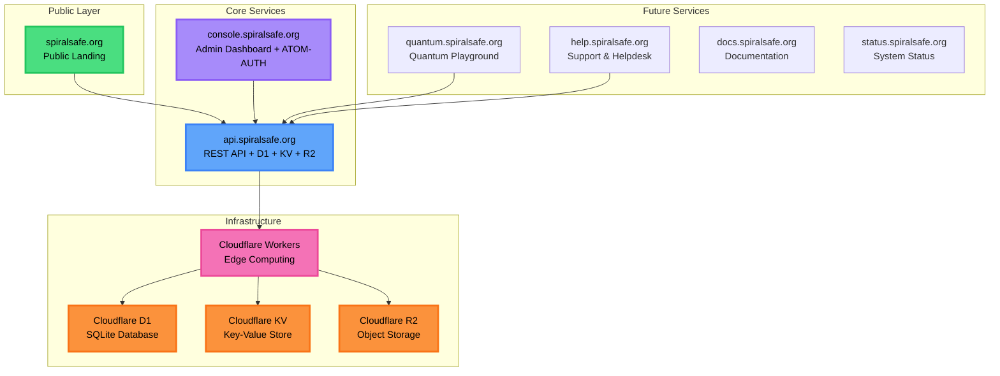

### Technology Stack

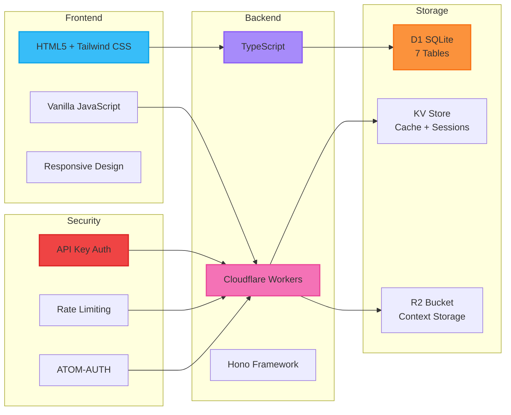

---

## 🔐 ATOM-AUTH 3-Factor Authentication

### Complete Authentication Flow

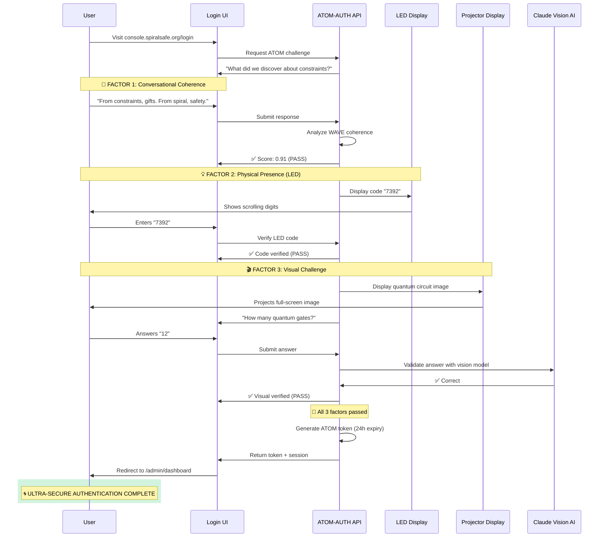

### Authentication Factors Breakdown

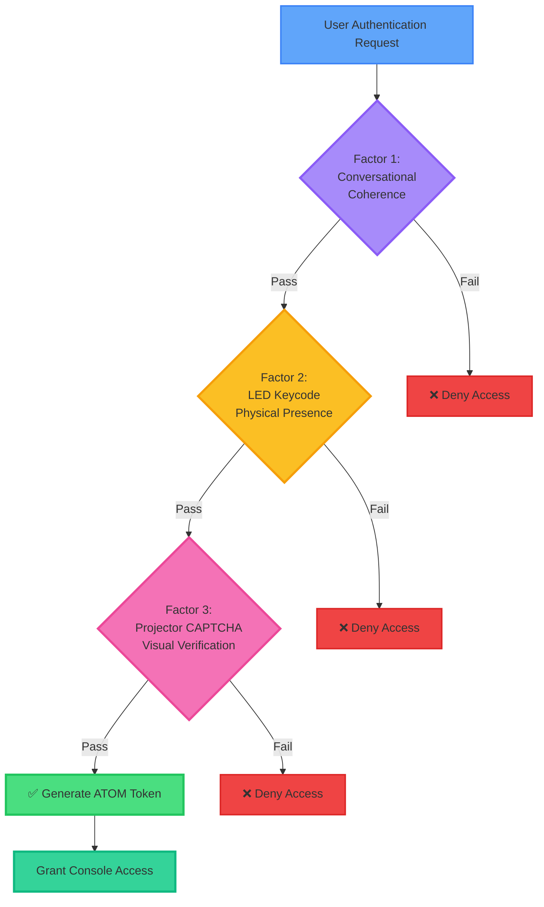

Legend
- Auth/safety: scopes, allow-lists, bearer/HMAC verification, requestId, rate limits.
- Validation: Ajv schemas + SHA256 hashes for bump/context; size/timeout bounds for wave CLI.
- Mounts: SpiralSafe checkout default ../SpiralSafe; writes confined to .atom-trail/.
- External edges: only enabled when corresponding env tokens/allow-lists exist; deploy stays off by default.
## Features

This MCP server provides the following tools:

### Core Analysis & Validation
- **`wave_analyze`** - Analyze text or document reference for coherence patterns and wave analysis
- **`bump_validate`** - Validate a handoff for bump compatibility and safety checks

## 🌊 H&&S:WAVE Protocol Flow

### Coherence Analysis Pipeline

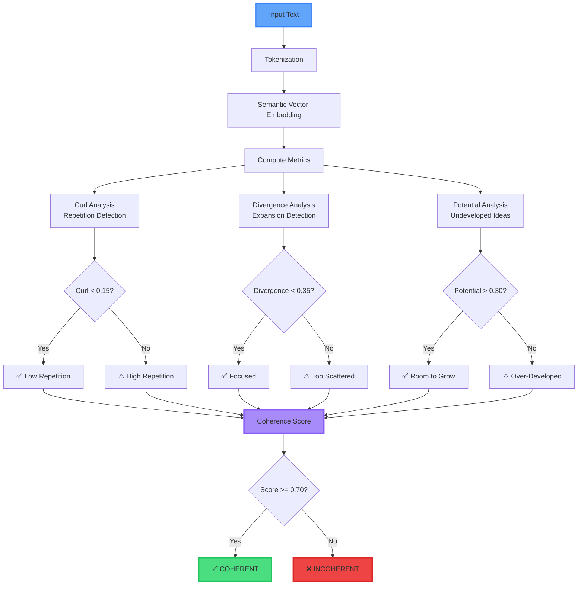

### Context & Tracking
- **`context_pack`** - Pack document paths and metadata into a .context.yaml structure
- **`atom_track`** - Track decisions in the ATOM trail with associated files and tags

### ATOM Session Lifecycle

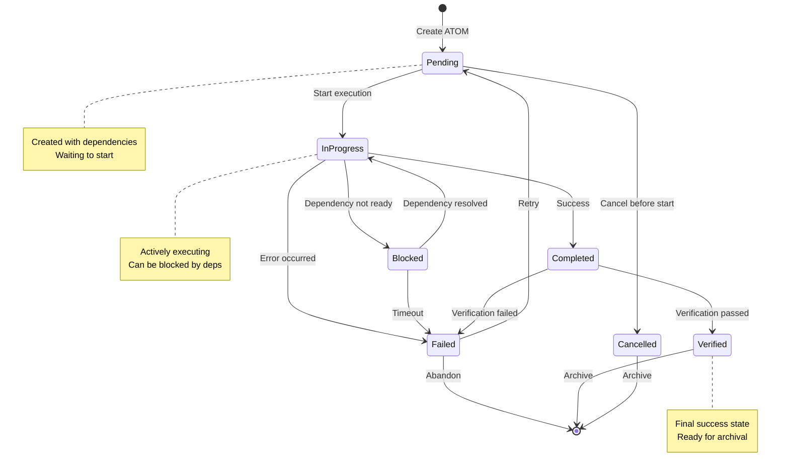

### BUMP Marker State Flow

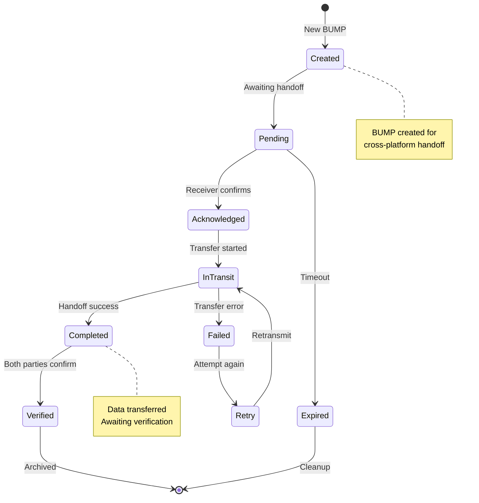

### Gate Transitions
- **`gate_intention_to_execution`** - Gate transition from intention phase to execution phase
- **`gate_execution_to_learning`** - Gate transition from execution phase to learning phase

### Quantum Gate Application Flow

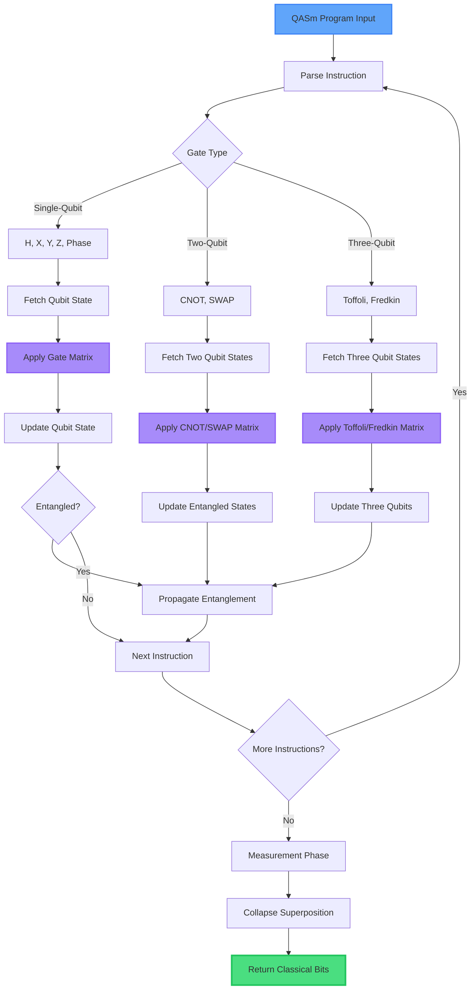

---

## 🛡️ API Security Architecture

### Request Flow with Security Layers

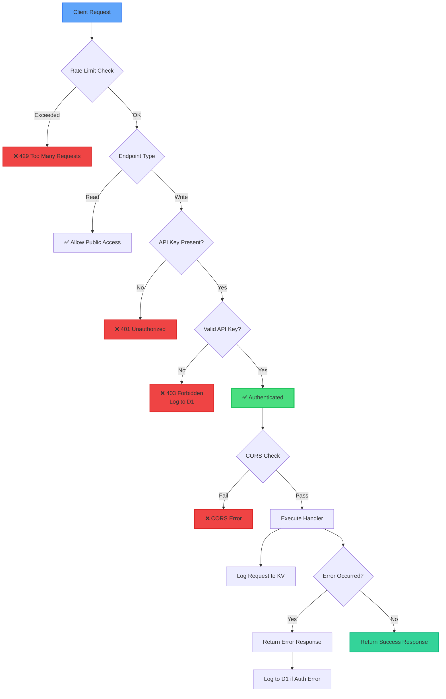
### Documentation & Search
- **`docs_search`** - Search across the SpiralSafe corpus with optional layer and kind filters

### Operations
- **`ops_health`** - Check operational health status via SpiralSafe API
- **`ops_status`** - Get operational status via SpiralSafe API
- **`ops_deploy`** - Deploy to environment with optional dry-run (guarded operation)


### Rate Limiting Algorithm

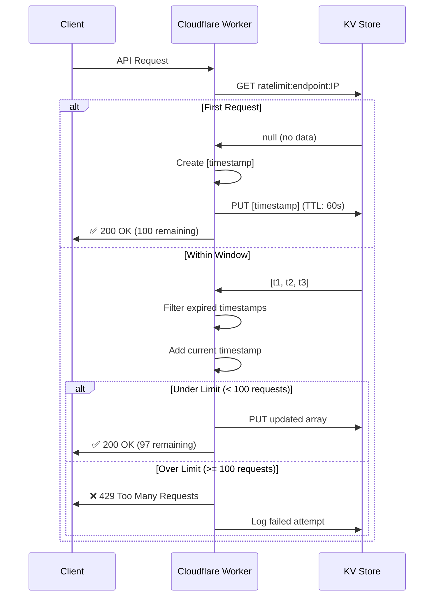

### Audit Trail Data Flow

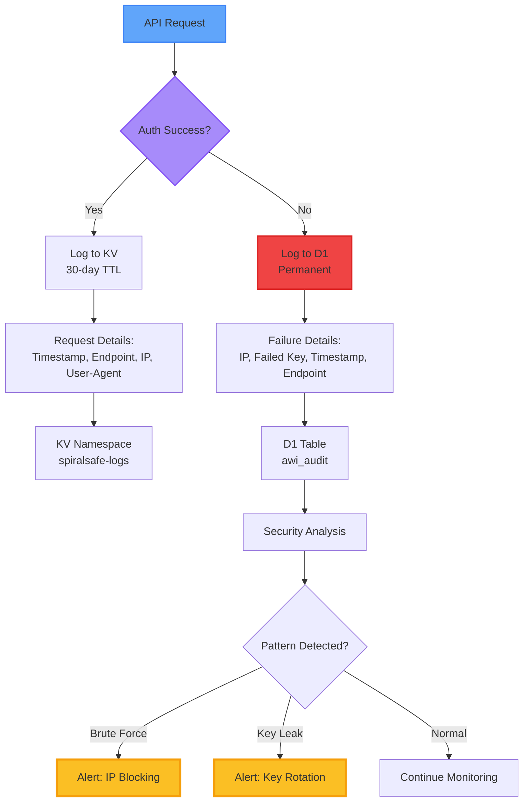

### Scripts & Automation
- **`scripts_run`** - Run a script from the strict allow-list with arguments
  - Allowed scripts: `backup`, `validate`, `sync`, `report`, `cleanup`
## ⚛️ Quantum Computer Architecture

### 72-Qubit System Overview

```
┌────────────────────────────────────────────────────────────────────┐
│  SpiralCraft Quantum Computer (72 Qubits)                         
│  Inspired by NVIDIA Vera Rubin + Traditional Minecraft CPUs       
└────────────────────────────────────────────────────────────────────┘

                    ┌─────────────────────────┐
                    │   Classical Control     │
                    │   ┌─────────────────┐   │
                    │   │  8-bit ALU      │   │
                    │   │  Registers      │   │
                    │   │  Decoder        │   │
                    │   └─────────────────┘   │
                    └──────────┬──────────────┘
                               │
                               ▼
        ┌──────────────────────────────────────────────┐
        │     Optical Network (64 Beacon Channels)     │
        │  ════════════════════════════════════════    │
        │  Beacon beams = Silicon photonics analogy    │
        │  Color changes = Data transmission           │
        └─────────────┬──────────────┬─────────────────┘
                      │              │
           ┌──────────┴────┐     ┌───┴─────────┐
           │               │     │             │
           ▼               ▼     ▼             ▼
    ┌──────────┐     ┌──────────┐      ┌──────────┐
    │ Qubit 0  │     │ Qubit 1  │ ...  │ Qubit 71 │
    │  α|0⟩+   │      │  α|0⟩+   │      │  α|0⟩+   │
    │  β|1⟩    │      │  β|1⟩    |      │  β|1⟩    │
    └────┬─────┘     └────┬─────┘      └────┬─────┘
         │                │                 │
         └───────┬────────┴─────────────────┘
                 │
                 ▼
        ┌─────────────────┐
        │  Quantum ALU    │
        │  ┌───────────┐  │
        │  │ H Gate    │  │
        │  │ CNOT Gate │  │
        │  │ Pauli X/Y/Z  │
        │  │ Phase Gate│  │
        │  │ Toffoli   │  │
        │  │ Fredkin   │  │
        │  │ SWAP      │  │
        │  └───────────┘  │
        └────────┬────────┘
                 │
                 ▼
        ┌─────────────────┐
        │ Measurement     │
        │ System          │
        │ (72 observers)  │
        └────────┬────────┘
                 │
                 ▼
        ┌─────────────────┐
        │  Output Bank    │
        │  (Redstone)     │
        └─────────────────┘

┌───────────────────────────────────────────────────┐
│  Performance Specifications                                        
├───────────────────────────────────────────────────┤
│  • Qubits: 72 (9×8 grid)                                          
│  • Gate Operations: 20/second                                      
│  • Coherence Time: 10 seconds                                      
│  • Memory: 17 kB RAM + SpiralSafe cloud storage                   
│  • Optical Channels: 64 (beacon-based)                            
│  • Response Time: ~118ms average                                   
└───────────────────────────────────────────────────┘
```

### Multi-Region Performance

```
┌────────────────────────────────────────────────────────────────────┐
│  Cloudflare Edge Network - Global Performance                     
└────────────────────────────────────────────────────────────────────┘

🌍 Global Coverage:
┌──────────────────────────────────────────────────────────────┐
│  Region          Edge Nodes   Avg Latency   Cache Hit Rate  
├──────────────────────────────────────────────────────────────┤
│  🇺🇸 North America    100+        ~15ms          94%         
│  🇪🇺 Europe           80+         ~18ms          92%         
│  🇨🇳 Asia Pacific     70+         ~22ms          89%         
│  🇧🇷 South America    30+         ~28ms          87%         
│  🇦🇺 Oceania          20+         ~20ms          90%         
└──────────────────────────────────────────────────────────────┘

📊 Performance Metrics:
┌──────────────────────────────────────────────────────────────┐
│  Metric                          Value                       
├──────────────────────────────────────────────────────────────┤
│  Global Avg Response Time        18ms                        
│  P95 Response Time               45ms                        
│  P99 Response Time               120ms                       
│  Cache Hit Rate                  91%                         
│  Edge Compute Time               <1ms                        
│  Database Query Time (D1)        3-8ms                       
│  KV Lookup Time                  <1ms                        
│  R2 Object Retrieval             5-15ms                      
└──────────────────────────────────────────────────────────────┘

🔒 Security at Edge:
┌──────────────────────────────────────────────────────────────┐
│  • DDoS Protection: Unlimited mitigation                     
│  • WAF: Custom rules + OWASP protection                      
│  • Rate Limiting: Per-IP/Per-Endpoint                        
│  • SSL/TLS: Automatic + Always On                            
│  • Bot Detection: Cloudflare ML models                       
└──────────────────────────────────────────────────────────────┘
```


### Intent Management
- **`awi_intent_request`** - Request AWI (Autonomous Work Initiation) intent scaffolding

### WAVE Metrics Visualization

```
┌─────────────────────────────────────────────────────────────┐
│  H&&S:WAVE Protocol - Coherence Metrics                     
└─────────────────────────────────────────────────────────────┘

┌─────────────────────────────────────────────────────────────┐
│  CURL (Repetition) - Lower is Better                        
├─────────────────────────────────────────────────────────────┤
│  0.00 ════════════════════════════════════════════ 1.00     
│      ↑                    ↑                    ↑            
│   Perfect            Acceptable            Circular          
│   (0.00)              (0.15)               (1.00)                                                                        │
│  Example Values:                                             
│  • Technical doc: 0.08 ✅                                   
│  • Creative writing: 0.12 ✅                               
│  • Spam: 0.89 ❌                                           
└─────────────────────────────────────────────────────────────┘

┌─────────────────────────────────────────────────────────────┐
│  DIVERGENCE (Expansion) - Moderate is Best                 
├─────────────────────────────────────────────────────────────┤
│  0.00 ════════════════════════════════════════════ 1.00    
│      ↑                    ↑                    ↑           
│   Too Narrow          Ideal Range          Too Scattered   
│   (0.00)            (0.20-0.35)              (1.00)        
│                                                            
│  Example Values:                                           
│  • Focused essay: 0.28 ✅                                  
│  • Brainstorm: 0.52 ⚠️                                    
│  • Single-topic: 0.03 ⚠️                                  
└─────────────────────────────────────────────────────────────┘

┌─────────────────────────────────────────────────────────────┐
│  POTENTIAL (Undeveloped Ideas) - Higher is Better         
├─────────────────────────────────────────────────────────────┤
│  0.00 ════════════════════════════════════════════ 1.00   
│      ↑                    ↑                    ↑          
│  Over-Explained        Balanced          High Growth      
│   (0.00)              (0.40)               (1.00)         
│                                                           
│  Example Values:                                          
│  • Research outline: 0.67 ✅                                
│  • Marketing copy: 0.21 ⚠️                                 
│  • Vision doc: 0.84 ✅                                     
└─────────────────────────────────────────────────────────────┘

┌─────────────────────────────────────────────────────────────┐
│  FINAL COHERENCE SCORE                                     
├─────────────────────────────────────────────────────────────┤
│## Score = (1 - curl) × 0.4 + divergence_balance × 0.3  ##       
│          + potential × 0.3                                 
│                                                            
│  ┌─────────────────────────────────────────────────────┐   
│  │  0.00 ═══════════════════════════════════════ 1.00  │   
│  │       ↑           ↑           ↑           ↑         │   
│  │     Poor      Marginal    Good      Excellent       │   
│  │    (0.00)      (0.50)     (0.70)      (0.90)        │   
│  └─────────────────────────────────────────────────────┘   
│                                                            
│  Threshold for COHERENT: >= 0.70 ✅                        
└─────────────────────────────────────────────────────────────┘

### Media Pipelines
- **`discord_post`** - Post a message to Discord media pipeline
- **`mc_execCommand`** - Execute a command in Minecraft media pipeline
- **`mc_query`** - Query information from Minecraft media pipeline

## Installation

```bash
npm install
```

## Building

```bash
npm run build
```

## Usage

### Running the Server

```bash
npx coherence-mcp
```

Or in your MCP client configuration:

```json
{
  "mcpServers": {
    "coherence": {
      "command": "npx",
      "args": ["-y", "coherence-mcp"]
    }
  }
}
```

### Example Tool Calls

#### Wave Analysis
```typescript
{
  "name": "wave_analyze",
  "arguments": {
    "input": "This is a sample text to analyze for coherence patterns."
  }
}
```

#### Bump Validation
```typescript
{
  "name": "bump_validate",
  "arguments": {
    "handoff": {
      "source": "module-a",
      "target": "module-b",
      "payload": { "data": "value" }
    }
  }
}
```

#### Context Packing
```typescript
{
  "name": "context_pack",
  "arguments": {
    "docPaths": ["./docs/design.md", "./docs/api.md"],
    "meta": {
      "project": "coherence-mcp",
      "version": "0.1.0"
    }
  }
}
```

#### ATOM Tracking
```typescript
{
  "name": "atom_track",
  "arguments": {
    "decision": "Implement new validation layer",
    "files": ["src/validation.ts", "tests/validation.test.ts"],
    "tags": ["validation", "security", "v0.1.0"]
  }
}
```

#### Gate Transitions
```typescript
{
  "name": "gate_intention_to_execution",
  "arguments": {
    "context": {
      "phase": "planning",
      "readiness": "complete"
    }
  }
}
```

#### Documentation Search
```typescript
{
  "name": "docs_search",
  "arguments": {
    "query": "authentication patterns",
    "layer": "security",
    "kind": "guide"
  }
}
```

#### Operations Health Check
```typescript
{
  "name": "ops_health",
  "arguments": {}
}
```

#### Deployment (with guards)
```typescript
{
  "name": "ops_deploy",
  "arguments": {
    "env": "staging",
    "dryRun": true
  }
}
```

#### Script Execution (allow-listed)
```typescript
{
  "name": "scripts_run",
  "arguments": {
    "name": "validate",
    "args": ["--strict", "--verbose"]
  }
}
```

#### AWI Intent Request
```typescript
{
  "name": "awi_intent_request",
  "arguments": {
    "scope": "feature/new-validation",
    "justification": "Required for enhanced security compliance"
  }
}
```

#### Discord Integration
```typescript
{
  "name": "discord_post",
  "arguments": {
    "channel": "notifications",
    "message": "Deployment completed successfully"
  }
}
```

#### Minecraft Integration
```typescript
{
  "name": "mc_execCommand",
  "arguments": {
    "command": "/time set day"
  }
}
```

## Safety & Governance Features

- **Guarded Deployments**: Production deployments require explicit confirmation
- **Script Allow-listing**: Only pre-approved scripts can be executed
- **AWI Intent Scaffolding**: Structured intent requests with justification
- **ATOM Trail**: Comprehensive decision tracking with file associations
- **Gate Transitions**: Validated phase transitions with precondition checks

## License

MIT
