# coherence-mcp

MCP server that surfaces coherence, governance, and safety primitives: Wave/Bump validation, ATOM trail + gates, .context.yaml packing, AWI intent scaffolding, and docs/search across the SpiralSafe corpus.

```mermaid
sequenceDiagram
    participant User
    participant Frontend as Login UI
    participant Backend as ATOM-AUTH API
    participant LED as LED Display
    participant Projector as Projector Display
    participant AI as Claude Vision AI

    User->>Frontend: Visit console.spiralsafe.org/login
    Frontend->>Backend: Request ATOM challenge
    Backend->>Frontend: "What did we discover about constraints?"

    Note over User,Frontend: 🧠 FACTOR 1: Conversational Coherence
    User->>Frontend: "From constraints, gifts. From spiral, safety."
    Frontend->>Backend: Submit response
    Backend->>Backend: Analyze WAVE coherence
    Backend->>Frontend: ✅ Score: 0.91 (PASS)

    Note over User,LED: 💡 FACTOR 2: Physical Presence (LED)
    Backend->>LED: Display code "7392"
    LED->>User: Shows scrolling digits
    User->>Frontend: Enters "7392"
    Frontend->>Backend: Verify LED code
    Backend->>Frontend: ✅ Code verified (PASS)

    Note over User,Projector: 🎬 FACTOR 3: Visual Challenge
    Backend->>Projector: Display quantum circuit image
    Projector->>User: Projects full-screen image
    Backend->>Frontend: "How many quantum gates?"
    User->>Frontend: Answers "12"
    Frontend->>Backend: Submit answer
    Backend->>AI: Validate answer with vision model
    AI->>Backend: ✅ Correct
    Backend->>Frontend: ✅ Visual verified (PASS)

    Note over Backend: 🎉 All 3 factors passed
    Backend->>Backend: Generate ATOM token (24h expiry)
    Backend->>Frontend: Return token + session
    Frontend->>User: Redirect to /admin/dashboard

    rect rgb(34, 197, 94, 0.2)
        Note over User: 🌀 ULTRA-SECURE AUTHENTICATION COMPLETE
    end
```



Legend
- Auth/safety: scopes, allow-lists, bearer/HMAC verification, requestId, rate limits.
- Validation: Ajv schemas + SHA256 hashes for bump/context; size/timeout bounds for wave CLI.
- Mounts: SpiralSafe checkout default ../SpiralSafe; writes confined to .atom-trail/.
- External edges: only enabled when corresponding env tokens/allow-lists exist; deploy stays off by default.
## Features

This MCP server provides the following tools:

### Core Analysis & Validation
- **`wave_analyze`** - Analyze text or document reference for coherence patterns and wave analysis
- **`bump_validate`** - Validate a handoff for bump compatibility and safety checks

```mermaid
graph TD
    A[User Authentication Request] --> B{Factor 1:<br/>Conversational<br/>Coherence}

    B -->|Pass| C{Factor 2:<br/>LED Keycode<br/>Physical Presence}
    B -->|Fail| X1[❌ Deny Access]

    C -->|Pass| D{Factor 3:<br/>Projector CAPTCHA<br/>Visual Verification}
    C -->|Fail| X2[❌ Deny Access]

    D -->|Pass| E[✅ Generate ATOM Token]
    D -->|Fail| X3[❌ Deny Access]

    E --> F[Grant Console Access]

    style A fill:#60a5fa,stroke:#3b82f6,stroke-width:2px
    style B fill:#a78bfa,stroke:#8b5cf6,stroke-width:3px
    style C fill:#fbbf24,stroke:#f59e0b,stroke-width:3px
    style D fill:#f472b6,stroke:#ec4899,stroke-width:3px
    style E fill:#4ade80,stroke:#22c55e,stroke-width:3px
    style F fill:#34d399,stroke:#10b981,stroke-width:3px
    style X1 fill:#ef4444,stroke:#dc2626,stroke-width:2px
    style X2 fill:#ef4444,stroke:#dc2626,stroke-width:2px
    style X3 fill:#ef4444,stroke:#dc2626,stroke-width:2px
```


### Context & Tracking
- **`context_pack`** - Pack document paths and metadata into a .context.yaml structure
- **`atom_track`** - Track decisions in the ATOM trail with associated files and tags


### Gate Transitions
- **`gate_intention_to_execution`** - Gate transition from intention phase to execution phase
- **`gate_execution_to_learning`** - Gate transition from execution phase to learning phase

### Documentation & Search
- **`docs_search`** - Search across the SpiralSafe corpus with optional layer and kind filters

### Operations
- **`ops_health`** - Check operational health status via SpiralSafe API
- **`ops_status`** - Get operational status via SpiralSafe API
- **`ops_deploy`** - Deploy to environment with optional dry-run (guarded operation)


### Scripts & Automation
- **`scripts_run`** - Run a script from the strict allow-list with arguments
  - Allowed scripts: `backup`, `validate`, `sync`, `report`, `cleanup`

### Intent Management
- **`awi_intent_request`** - Request AWI (Autonomous Work Initiation) intent scaffolding

### Media Pipelines
- **`discord_post`** - Post a message to Discord media pipeline
- **`mc_execCommand`** - Execute a command in Minecraft media pipeline
- **`mc_query`** - Query information from Minecraft media pipeline

## Installation

```bash
npm install
```

## Building

```bash
npm run build
```

## Usage

### Running the Server

```bash
npx coherence-mcp
```

Or in your MCP client configuration:

```json
{
  "mcpServers": {
    "coherence": {
      "command": "npx",
      "args": ["-y", "coherence-mcp"]
    }
  }
}
```

### Example Tool Calls

#### Wave Analysis
```typescript
{
  "name": "wave_analyze",
  "arguments": {
    "input": "This is a sample text to analyze for coherence patterns."
  }
}
```

#### Bump Validation
```typescript
{
  "name": "bump_validate",
  "arguments": {
    "handoff": {
      "source": "module-a",
      "target": "module-b",
      "payload": { "data": "value" }
    }
  }
}
```

#### Context Packing
```typescript
{
  "name": "context_pack",
  "arguments": {
    "docPaths": ["./docs/design.md", "./docs/api.md"],
    "meta": {
      "project": "coherence-mcp",
      "version": "0.1.0"
    }
  }
}
```

#### ATOM Tracking
```typescript
{
  "name": "atom_track",
  "arguments": {
    "decision": "Implement new validation layer",
    "files": ["src/validation.ts", "tests/validation.test.ts"],
    "tags": ["validation", "security", "v0.1.0"]
  }
}
```

#### Gate Transitions
```typescript
{
  "name": "gate_intention_to_execution",
  "arguments": {
    "context": {
      "phase": "planning",
      "readiness": "complete"
    }
  }
}
```

#### Documentation Search
```typescript
{
  "name": "docs_search",
  "arguments": {
    "query": "authentication patterns",
    "layer": "security",
    "kind": "guide"
  }
}
```

#### Operations Health Check
```typescript
{
  "name": "ops_health",
  "arguments": {}
}
```

#### Deployment (with guards)
```typescript
{
  "name": "ops_deploy",
  "arguments": {
    "env": "staging",
    "dryRun": true
  }
}
```

#### Script Execution (allow-listed)
```typescript
{
  "name": "scripts_run",
  "arguments": {
    "name": "validate",
    "args": ["--strict", "--verbose"]
  }
}
```

#### AWI Intent Request
```typescript
{
  "name": "awi_intent_request",
  "arguments": {
    "scope": "feature/new-validation",
    "justification": "Required for enhanced security compliance"
  }
}
```

#### Discord Integration
```typescript
{
  "name": "discord_post",
  "arguments": {
    "channel": "notifications",
    "message": "Deployment completed successfully"
  }
}
```

#### Minecraft Integration
```typescript
{
  "name": "mc_execCommand",
  "arguments": {
    "command": "/time set day"
  }
}
```

## Safety & Governance Features

- **Guarded Deployments**: Production deployments require explicit confirmation
- **Script Allow-listing**: Only pre-approved scripts can be executed
- **AWI Intent Scaffolding**: Structured intent requests with justification
- **ATOM Trail**: Comprehensive decision tracking with file associations
- **Gate Transitions**: Validated phase transitions with precondition checks

## License

MIT
