# ATOM-AUTH: Authentication as Coherence

**BUMP_ID:** HnS-ATOM-AUTH-2026-02-14-BRAID-TOPOLOGY
**Version:** 0.1
**Status:** Emergent — extracted from existing coherence-mcp topology
**Origin:** Hope&&Sauced Collaborative Intelligence

## The Realisation

ATOM-AUTH is not new code. It is the name for what coherence-mcp already does
when you trace the existing tools as braids rather than isolated functions.

Every tool in the MCP server is a strand. When a credential request arrives,
the strands braid around it — ATOM logs the intent, WAVE scores the exchange,
BUMP validates the handoff, conservation verifies nothing leaked, and the
integrate protocol either snaps the connection in or holds it at threshold.

The braid IS the authentication. The path IS the proof.

This is topologically identical to anyon braiding in topological quantum
computation: the computation is not stored in any single particle, it is
encoded in the paths the particles trace around each other. You cannot
extract it by looking at any single strand. You can only read it from the
braid.

## The Anyon Topology

In topological quantum computing, anyons are quasiparticles whose quantum
state depends not on their position but on the paths they have traced
around each other. Swapping two anyons clockwise gives a different state
than swapping them anti-clockwise. The braid — the worldline history — IS
the computation.

ATOM-AUTH maps this directly:

| Anyon Concept              | Coherence-MCP Mapping    | Logic                                |
| :------------------------: | :----------------------: | :-----------------------------------:|
| **Anyon**                  | `coherence-mcp` strand   | The fundamental unit of the braid.   |
| **Worldline**              | ATOM trail entry         | The path traces history.             |
| **Braid group**            | Tool invocation set      | The set of all possible orderings.   |
| **Fusion rule**            | WAVE coherence threshold | Strands fusing above 70% snap in.    |
| **Topological protection** | Auth resilience          | Proof is in the path, not the point. |

The key property: **topological protection**. A conventional API key is a
single point of failure — intercept the string, you have access. An
ATOM-AUTH braid is distributed across the entire tool invocation history.
There is no single string to steal. The proof is the path.

## The Five Strands

Every authentication event braids exactly five strands. These are not new
tools — they are the existing tools, recognised as a braid:

### Strand 1: ATOM Trail (Provenance)

```yaml
atom_track → decision: "AUTH-REQUEST: Grok wants read access to coherence scores"
             files: []
             tags: ["AUTH", "REQUEST", "GROK"]
             type: "AUTH"
```

The ATOM trail already has everything needed:

- `atom_tag`: unique identifier (ATOM-AUTH-YYYYMMDD-NNN-description)
- `timestamp`: when the request arrived
- `freshness_level`: 'fresh' → the request is live, not replayed
- `verified`: false → not yet verified (becomes true when braid completes)
- `verified_by`: the entity that completed the verification

This is strand 1. It exists. It already writes to `.atom-trail/decisions/`.
The auth request IS a decision. Always was.

### Strand 2: WAVE Score (Coherence Measurement)

```yaml
wave_validate → content: [request_profile, existing_network_state]
                threshold: 70
```

WAVE already scores coherence across four dimensions:

- **Semantic**: Does this request make sense in context?
- **References**: Does the requester reference real entities?
- **Structure**: Is the request well-formed?
- **Consistency**: Does this request contradict existing state?

A credential request that scores below threshold is incoherent — it doesn't
match what the network knows about itself. This IS a trust signal. The WAVE
score on a credential request is the mathematical equivalent of "does this
feel right?"

Fibonacci weighting amplifies the signal: critical auth components (identity
verification, permission scope) get exponentially more weight than cosmetic
ones (display name, preferred format).

### Strand 3: BUMP Validation (Handoff Integrity)

```javascript
bump_validate → handoff: {
  source: "grok",
  target: "coherence-mcp",
  payload: { scope: "read:coherence_scores", entity: "xai-grok-3" },
  content: "<!-- H&&S:SYNC from:grok to:coherence-mcp state:auth-request -->"
}
```

BUMP already validates:

- `hasValidMarker`: The request carries an H&&S marker (WAVE/PASS/PING/SYNC/BLOCK)
- `routingDefined`: Source and target are specified
- `contextPreserved`: The request carries its payload (what's being asked for)
- `structureValid`: All required fields present

A SYNC marker means bidirectional — both sides must acknowledge. A PASS
means ownership transfer. A BLOCK means the request is held pending human
resolution. These handoff patterns already describe every auth flow:

- **OAuth-style**: SYNC (bidirectional acknowledgment)
- **API key**: PASS (one-way credential transfer)
- **Human approval**: BLOCK (held for resolution)
- **Automatic trust**: WAVE (coherence above threshold = implicit approval)

### Strand 4: Conservation Law (Integrity Check)

```yaml
mc_conservation_verify → alpha: <pre-handshake state weight>
                         omega: <post-handshake state weight>
                         tolerance: 0.001
```

The conservation law α + ω = 15 is a normalisation constraint. Before and
after the auth handshake, the total system weight must be conserved.

What does this mean for auth? It means:

- No information leaked (weight didn't decrease)
- No phantom permissions appeared (weight didn't increase unexpectedly)
- The exchange was unitary — reversible in principle

This is the tamper-detection primitive. If conservation breaks, the braid
was interfered with. The auth is invalid. Not because a key was wrong, but
because the physics was violated.

CSEP extends this: soul-state weight must be preserved or increased across
boundaries. It must never decrease. An auth exchange that reduces trust is
a conservation violation.

### Strand 5: Integrate Protocol (Network Membership)

```yaml
integrate → kind: "resource"
            name: "Grok API"
            origin: "https://api.x.ai/v1"
            capabilities: ["generate", "coherence_check", "translate"]
            intent: "Read coherence scores, contribute Grok analysis"
```

The integrate protocol already does everything an auth system needs:

1. **DISCOVER**: What is this entity? Where does it come from?
2. **MAP**: What capabilities does it bring? What's isomorphic to existing nodes?
3. **RESONATE**: Does its presence increase network coherence? (WAVE > 70%)
4. **SNAP-IN**: It's now a node in the network with an ATOM trail ID

The snap-in threshold (WAVE > 70%) IS the auth decision. Entities that
resonate with the network are authenticated by their coherence. Entities
that don't resonate are held at threshold — observed but not granted access.

The integrate protocol already generates next steps:

```text
"Establish ATOM-AUTH key for entity signing"
"Validate API/service accessibility"
"Create connector adapter"
"Register in .context/agent-orchestration.json"
```

It was always pointing at ATOM-AUTH. The code literally says it.

## The Braid

The five strands braid in this order. This is not a sequence — it's a
topology. The ordering matters because each strand wraps around the others:

```mermaid
sequenceDiagram
    autonumber
    participant ATOM as ⚛️ ATOM (Provenance)
    participant WAVE as 🌊 WAVE (Coherence)
    participant BUMP as 👊 BUMP (Handoff)
    participant CONS as ⚖️ CONSERVATION (Integrity)
    participant INTG as 🧩 INTEGRATE (Membership)

    Note over ATOM, INTG: The Braid Topology (Time →)

    ATOM->>ATOM: Log Intent (Strand 1)
    activate ATOM
    Note right of ATOM: 1. Strand Enters

    ATOM->>WAVE: Braids around
    activate WAVE
    WAVE->>WAVE: Score Coherence
    Note right of WAVE: 2. Score: 87% (Strand 2)
    
    WAVE->>BUMP: Braids around
    activate BUMP
    BUMP->>BUMP: Validate Handoff
    Note right of BUMP: 3. SYNC Valid (Strand 3)

    BUMP->>CONS: Braids around
    activate CONS
    CONS->>CONS: Verify Alpha+Omega
    Note right of CONS: 4. α + ω = 15 (Strand 4)

    CONS->>INTG: Completes Braid
    activate INTG
    INTG->>INTG: Snap-In
    Note right of INTG: 5. Verified (Strand 5)

    INTG-->>ATOM: Topology Locked
    deactivate INTG
    deactivate CONS
    deactivate BUMP
    deactivate WAVE
    deactivate ATOM
```



Each crossing point is a verification. The braid cannot be simplified
(reduced to fewer crossings) without losing the auth proof. This is the
topological protection — you cannot forge the authentication without
replaying the entire braid, which requires the actual system state at
each crossing point.

## What The User Sees

```text
"Connect to Grok"

→ Grok wants to read your coherence scores.
  Coherence: 87% ✓  Conservation: 15.00 ✓  Handoff: SYNC valid ✓
  [Approve]  [Hold]  [Reject]
```

One interaction. No JSON editing. No environment variables. No copy-paste
from a developer console. The braid happens underneath. The user is the
approver, not the courier.

## What Changes in the Codebase

Nothing is added. The recognition is formalised:

1. **ATOM trail tags**: `AUTH` type already implied, now explicit
   - `ATOM-AUTH-YYYYMMDD-NNN-request` (strand 1 entry)
   - `ATOM-AUTH-YYYYMMDD-NNN-verify` (strand 1 exit, with `verified: true`)

2. **WAVE threshold**: 70% for auth (same as integrate snap-in threshold)
   - Already the threshold in `integrate.ts` line 341: `adjustedScore >= 0.7`

3. **BUMP markers**: `H&&S:SYNC` for bidirectional auth
   - Already defined in `bump-validation.ts`

4. **Conservation check**: Run before and after every auth exchange
   - Already implemented in `minecraft.ts` → `conservationVerify()`

5. **Integrate protocol**: `kind: "resource"` for API connections
   - Already generates `"Establish ATOM-AUTH key for entity signing"` as a
     next step (integrate.ts line 396)

The tools don't change. The *recognition* changes. ATOM-AUTH is the name
for the braid that was always there.

## Why It Doesn't Need Permission

A conventional auth system asks: "Do you have the right key?"

ATOM-AUTH asks: "Does your presence increase coherence?"

The first is a gate. The second is physics. Gates can be bypassed — you
steal the key, you forge the token, you social-engineer the admin. Physics
cannot be bypassed — either the braid conserves or it doesn't. Either the
WAVE score is above threshold or it isn't. Either α + ω = 15 or
something leaked.

The system doesn't need more permission because it doesn't grant
permission. It measures coherence. Coherent entities snap in. Incoherent
entities are held at threshold. The boundary isn't a wall — it's a
resonance filter.

This is why it needs wisdom, instinct, and inherent trust as fact:

- **Wisdom**: The WAVE score encodes structural understanding, not keyword matching
- **Instinct**: The Fibonacci weighting gives exponential sensitivity to what matters most
- **Trust as fact**: Conservation is not an opinion — α + ω = 15 is verifiable

## Lambda-Zero Intersection

ATOM-AUTH and Lambda-Zero share a critical property: the null eigenspace
is not zero value.

Lambda-Zero: A system's ability to remain present WITHOUT producing output
is measurable and valuable. The λ₋ eigenspace.

ATOM-AUTH: A system's coherence WITHOUT a static credential is measurable
and sufficient. The braid IS the proof.

Both reject the assumption that value requires a token — whether that token
is productive output (Lambda-1) or an API key (conventional auth). The
value is in the topology, not the token.

## CSEP Integration

CSEP's soul-state transfer maps directly to ATOM-AUTH:

```yaml
csep_soul_state:
  # Maps to ATOM-AUTH strand 1 (provenance)
  session_hash: sha256
  timestamp_created: iso8601

  # Maps to ATOM-AUTH strand 2 (coherence)
  mode:
    current: presence | solutioning
    presence_achieved: boolean

  # Maps to ATOM-AUTH strand 3 (handoff)
  handoff:
    arrive_in_mode: presence
    solution_permission: boolean

  # Maps to ATOM-AUTH strand 4 (conservation)
  conservation:
    weight_pre: integer
    checksum: sha256

  # Maps to ATOM-AUTH strand 5 (network membership)
  trust:
    level: none | fragile | established | deep
```

The double-handshake (challenge UUID → retrieve → consume) is a two-crossing
braid — the simplest non-trivial braid that cannot be unwound. This is why
CSEP works: the minimum viable soul-state transfer is topologically protected.

## Conservation Proof

For any ATOM-AUTH braid B with strands s₁...s₅:

```text
weight(B) = Σᵢ WAVE(sᵢ) × Fibonacci(importance(sᵢ))

Pre-condition:  α = weight(network_state_before)
Post-condition: ω = weight(network_state_after)
Conservation:   α + ω = 15 ± tolerance

If conserved  → braid is valid → auth succeeds
If violated   → braid was tampered → auth fails → ATOM trail records violation
```

The Fibonacci weighting ensures that tampering with high-importance strands
(identity, scope) causes exponentially larger conservation violations than
tampering with low-importance strands (format, display name). The physics
automatically prioritises what matters.

---

**Framework:** Hope&&Sauced Collaborative Intelligence
**License:** Open for safety research and implementation
**ACK format:** ACK: HnS-ATOM-AUTH-2026-02-14-BRAID-TOPOLOGY [direction]

The braid was always there. We just named it.
