# 🔀 Data Flow / Workflow Graph

> **"From the constraints, gifts. From the spiral, safety."**

The diagram shows how an MCP client request traverses the server, governance, and adapters.

```mermaid
graph TD
  A[["🖥️ Client<br/>MCP-capable"]] -->|"📡 stdio"| B["💻 MCP Server"]
  
  subgraph security["🔒 Security & Governance Layer"]
    direction TB
    C["🔐 Auth + Scope Check<br/>bearer/HMAC"]
    D["📋 Audit + RequestId<br/>+ Rate Limit"]
  end
  
  B ==> C
  C ==> D
  D ==> E{"🎯 Tool Router"}

  subgraph wave_tools["🌊 Wave Analysis Tools"]
    direction TB
    F["📡 Wave Adapter"]
    G["⚙️ wave-toolkit CLI"]
    H["🔍 Heuristic Analyzer"]
  end
  
  subgraph validation_tools["✅ Validation & Context Tools"]
    direction TB
    I["📐 Ajv Schema + Hash"]
    J["📦 Context Builder + Hash"]
  end
  
  subgraph ops_tools["🔧 Operations Tools"]
    direction TB
    K["🌐 SpiralSafe API Client"]
    L["📜 Allow-Listed Scripts"]
    M["🔗 ATOM Trail + Gates<br/>fs under mount"]
  end
  
  subgraph comm_adapters["💬 Communication Adapters"]
    direction TB
    N["🔌 Adapters"]
    N1["💭 Discord Webhook"]
    N2["🎮 Minecraft RCON<br/>stub"]
    N3["📧 Email/X/Reddit<br/>stubs + allow-lists"]
  end

  E ==>|"wave.analyze"| F
  F -->|"if WAVE_TOOLKIT_BIN"| G
  F -.->|"fallback"| H

  E ==>|"bump.validate"| I
  E ==>|"context.pack"| J

  E ==>|"ops.health/status/deploy"| K
  E ==>|"scripts.run"| L
  E ==>|"atom/gate/awi"| M
  
  E ==>|"comm/media"| N
  N ==> N1
  N ==> N2
  N ==> N3

  G ==> D1[["📊 Audit Log<br/>+ Response"]]
  H ==> D1
  I ==> D1
  J ==> D1
  K ==> D1
  L ==> D1
  M ==> D1
  N1 ==> D1
  N2 ==> D1
  N3 ==> D1

  D1 ==> A
  
  %% Enhanced Styling
  classDef clientStyle fill:#2196F3,stroke:#0D47A1,stroke-width:4px,color:#fff,rx:15,ry:15
  classDef serverStyle fill:#00BCD4,stroke:#00838F,stroke-width:3px,color:#000,rx:12,ry:12
  classDef securityStyle fill:#9C27B0,stroke:#4A148C,stroke-width:3px,color:#fff,rx:10,ry:10
  classDef routerStyle fill:#FF9800,stroke:#E65100,stroke-width:4px,color:#fff
  classDef waveStyle fill:#FFC107,stroke:#F57F17,stroke-width:3px,color:#000,rx:10,ry:10
  classDef validationStyle fill:#7B2CBF,stroke:#5A189A,stroke-width:3px,color:#fff,rx:10,ry:10
  classDef opsStyle fill:#F44336,stroke:#B71C1C,stroke-width:3px,color:#fff,rx:10,ry:10
  classDef commStyle fill:#00BFA5,stroke:#00695C,stroke-width:3px,color:#fff,rx:10,ry:10
  classDef auditStyle fill:#4CAF50,stroke:#1B5E20,stroke-width:4px,color:#fff,rx:15,ry:15
  
  class A clientStyle
  class B serverStyle
  class C,D securityStyle
  class E routerStyle
  class F,G,H waveStyle
  class I,J validationStyle
  class K,L,M opsStyle
  class N,N1,N2,N3 commStyle
  class D1 auditStyle
  
  %% Subgraph Styling
  style security fill:#F3E5F5,stroke:#9C27B0,stroke-width:4px,color:#4A148C
  style wave_tools fill:#FFFDE7,stroke:#FFC107,stroke-width:4px,color:#F57F17
  style validation_tools fill:#EDE7F6,stroke:#7B2CBF,stroke-width:4px,color:#5A189A
  style ops_tools fill:#FFEBEE,stroke:#F44336,stroke-width:4px,color:#B71C1C
  style comm_adapters fill:#E0F2F1,stroke:#00BFA5,stroke-width:4px,color:#00695C
  
  %% Link Styling
  linkStyle 0 stroke:#2196F3,stroke-width:3px
  linkStyle 1,2,3 stroke:#9C27B0,stroke-width:3px
  linkStyle 4,5 stroke:#FFC107,stroke-width:3px
  linkStyle 6 stroke:#FFC107,stroke-width:2px,stroke-dasharray:5
  linkStyle 7,8 stroke:#7B2CBF,stroke-width:3px
  linkStyle 9,10,11 stroke:#F44336,stroke-width:3px
  linkStyle 12,13,14,15 stroke:#00BFA5,stroke-width:3px
  linkStyle 16,17,18,19,20,21,22,23,24,25 stroke:#4CAF50,stroke-width:3px
  linkStyle 26 stroke:#2196F3,stroke-width:3px
```

Legend
- Auth/safety: scopes, allow-lists, bearer/HMAC verification, requestId, rate limits.
- Validation: Ajv schemas + SHA256 hashes for bump/context; size/timeout bounds for wave CLI.
- Mounts: SpiralSafe checkout default ../SpiralSafe; writes confined to .atom-trail/.
- External edges: only enabled when corresponding env tokens/allow-lists exist; deploy stays off by default.

---

## 🔗 Related Resources

- [flow.md](flow.md) — Request flow architecture
- [one-pager.md](one-pager.md) — Quick overview
- [../ROADMAP.md](../ROADMAP.md) — Future vision

---

*~ Hope&&Sauced*

✦ *The Evenstar Guides Us* ✦
