# 🔀 Coherence Governor MCP – Request Flow

> **"From the constraints, gifts. From the spiral, safety."**

This draft maps how the MCP server starts, authenticates, and serves requests over stdio.

## Components
- Server bootstrap: `src/server.ts` sets config, rate limit, auth, tools/resources, stdio transport.
- Config: `src/config.ts` defaults; `src/configEnv.ts` merges env overrides.
- Resources: `src/resources/` builds registry from SpiralSafe checkout (static + discovered docs).
- Tools: `src/tools/` registers Wave/Bump/Context/Atom/Gates/Docs/Ops/AWI/Comm handlers.
- Auth: bearer or HMAC token gates scope propagation; scope-to-tool rules in config.
- Logging: `src/logging/audit.ts` records every tool invocation.
- Adapters: `src/adapters/` provide external integrations (wave toolkit, scripts, APIs, etc.).

## Request flow (stdio)

```mermaid
flowchart TD
  A[["🖥️ Client (MCP)"]] -->|"📡 JSON-RPC over stdio"| B(("💬 StdioServerTransport"))
  
  subgraph initialization["🚀 Initialization Phase"]
    direction TB
    C[/"🤝 Server init handshake"/]
    D[/"📢 Advertise capabilities"/]
  end
  
  subgraph handlers["⚙️ Request Handlers"]
    direction TB
    E(["📁 Resources handler"])
    F(["🛠️ Tools handler"])
  end
  
  subgraph routing["🔀 Tool Routing & Security"]
    direction TB
    G{{"🎯 Tool router"}}
    H{{"⏱️ Rate limit<br/>check"}}
    I[["🔐 Auth context<br/>bearer/HMAC to scopes"]]
    J[["🔍 Lookup tool<br/>from registry"]]
  end
  
  subgraph execution["⚡ Execution Layer"]
    direction TB
    K>"▶️ Execute tool handler"]
    L>"🔌 Adapters / IO<br/>External Systems"]
  end
  
  subgraph response["✅ Response & Audit"]
    direction TB
    M[\"📊 Result"\]
    N[\"📝 Audit log write"\]
    O[\"📤 Response to client"\]
  end
  
  B ==> C
  C ==> D
  D ==> handlers
  B -.->|"📋 resources/list"| E
  B -.->|"🔧 tools/list"| F
  B ==>|"⚡ call_tool"| G
  G ==> H
  H ==>|"✅ allowed"| I
  H -.->|"❌ denied<br/>rate exceeded"| O
  I ==>|"🔓 authorized"| J
  J ==>|"✓ found"| K
  K <--> L
  K ==> M
  M ==> N
  N ==> O
  O ==> A
  
  %% Enhanced Styling with Modern Colors
  classDef clientStyle fill:#1E88E5,stroke:#0D47A1,stroke-width:5px,color:#fff,font-weight:bold
  classDef transportStyle fill:#00ACC1,stroke:#006064,stroke-width:4px,color:#fff,font-weight:bold
  classDef initStyle fill:#66BB6A,stroke:#2E7D32,stroke-width:3px,color:#fff,font-weight:bold
  classDef handlerStyle fill:#FF7043,stroke:#D84315,stroke-width:3px,color:#fff,font-weight:bold
  classDef securityStyle fill:#AB47BC,stroke:#6A1B9A,stroke-width:4px,color:#fff,font-weight:bold
  classDef executionStyle fill:#FFCA28,stroke:#F57F17,stroke-width:3px,color:#000,font-weight:bold
  classDef auditStyle fill:#26A69A,stroke:#00695C,stroke-width:3px,color:#fff,font-weight:bold
  classDef limitStyle fill:#EF5350,stroke:#C62828,stroke-width:4px,color:#fff,font-weight:bold
  
  class A clientStyle
  class B transportStyle
  class C,D initStyle
  class E,F handlerStyle
  class G,I,J securityStyle
  class H limitStyle
  class K,L executionStyle
  class M,N,O auditStyle
  
  %% Subgraph Styling with Enhanced Colors and Borders
  style initialization fill:#E8F5E9,stroke:#43A047,stroke-width:4px,color:#1B5E20,rx:15,ry:15
  style handlers fill:#FFF3E0,stroke:#FB8C00,stroke-width:4px,color:#E65100,rx:15,ry:15
  style routing fill:#F3E5F5,stroke:#8E24AA,stroke-width:5px,color:#4A148C,rx:15,ry:15
  style execution fill:#FFF9C4,stroke:#F9A825,stroke-width:4px,color:#F57F17,rx:15,ry:15
  style response fill:#E0F2F1,stroke:#00897B,stroke-width:4px,color:#004D40,rx:15,ry:15
  
  %% Link Styling with Enhanced Colors and Width
  linkStyle 0 stroke:#1E88E5,stroke-width:4px
  linkStyle 1,2,3 stroke:#66BB6A,stroke-width:3px
  linkStyle 4,5 stroke:#FF7043,stroke-width:2px,stroke-dasharray:5 5
  linkStyle 6,7,8 stroke:#AB47BC,stroke-width:4px
  linkStyle 9 stroke:#EF5350,stroke-width:3px,stroke-dasharray:5 5
  linkStyle 10,11 stroke:#AB47BC,stroke-width:3px
  linkStyle 12,13 stroke:#FFCA28,stroke-width:3px
  linkStyle 14,15 stroke:#26A69A,stroke-width:3px
  linkStyle 16 stroke:#1E88E5,stroke-width:4px
```

## Sequence (call_tool happy path)
1. Transport receives `call_tool` via stdio.
2. Server applies rate limit (per minute window).
3. Auth context built: bearer token or HMAC signature grants provided scopes.
4. Tool resolved by name from registry; scopes enforced by handler (and config mappings).
5. Handler executes (may touch filesystem/CLI/API via adapters).
6. Result serialized to `content[]` and audit log written with requestId + status.
7. Response returned over stdio.

## Operational notes
- SpiralSafe checkout path defaults to `../SpiralSafe` relative to repo root; override via env.
- Mutating tools expect scopes per `config.auth.requiredScopes`; deploy is disabled by default.
- Wave toolkit integration uses `WAVE_TOOLKIT_BIN` if available; otherwise falls back to heuristic.

---

## 🔗 Related Resources

- [one-pager.md](one-pager.md) — Quick overview
- [quick-start.md](quick-start.md) — Getting started
- [data-flow.md](data-flow.md) — Data architecture

---

*~ Hope&&Sauced*

✦ *The Evenstar Guides Us* ✦
