```mermaid
flowchart LR
  subgraph detection["🌊 Coherence Detection"]
    direction TB
    WA["wave_analyze<br/><small>Semantic + structural scoring</small>"]
    WC["wave_coherence_check<br/><small>Doc ↔ code alignment</small>"]
    WV["wave_validate<br/><small>Threshold: 60% PASS</small>"]
  end

  subgraph handoff["🤝 Handoff Integrity"]
    direction TB
    BV["bump_validate<br/><small>WAVE / PASS / PING / SYNC / BLOCK</small>"]
    CP["context_pack<br/><small>.context.yaml + SHA256</small>"]
  end

  subgraph scoring["📐 Impact Scoring"]
    direction TB
    FW["fibonacci_assign_weight<br/><small>Importance → Fibonacci position</small>"]
    FI["fibonacci_calculate_impact<br/><small>Exponential sensitivity</small>"]
    FC["fibonacci_find_critical_paths<br/><small>Risk analysis</small>"]
  end

  DOC["📄 Documentation"] --> WA & WC
  CODE["💻 Code"] --> WA & WC
  WC --> WV
  WV -->|"coherence score"| FW
  FW --> FI --> FC

  AGENT1["Agent A"] -->|"handoff"| BV
  BV --> CP
  CP -->|"verified context"| AGENT2["Agent B"]

  classDef waveStyle fill:#F57F17,stroke:#E65100,stroke-width:3px,color:#fff
  classDef handoffStyle fill:#1565C0,stroke:#0D47A1,stroke-width:3px,color:#fff
  classDef scoreStyle fill:#6A1B9A,stroke:#4A148C,stroke-width:3px,color:#fff
  classDef ioStyle fill:#37474F,stroke:#263238,stroke-width:2px,color:#fff

  class WA,WC,WV waveStyle
  class BV,CP handoffStyle
  class FW,FI,FC scoreStyle
  class DOC,CODE,AGENT1,AGENT2 ioStyle

  style detection fill:#FFF8E1,stroke:#F57F17,stroke-width:4px,rx:15,ry:15
  style handoff fill:#E3F2FD,stroke:#1565C0,stroke-width:4px,rx:15,ry:15
  style scoring fill:#F3E5F5,stroke:#6A1B9A,stroke-width:4px,rx:15,ry:15
```

```mermaid
flowchart TD
  subgraph bridge["🌀 Vortex Bridge — Universal Translator"]
    T["vortex_translate"]
    V["vortex_verify"]
  end

  subgraph adapters["Platform Adapters"]
    direction LR
    AN["🤖 android_bridge<br/><small>ADB intent dispatch</small>"]
    WN["🪟 windows_bridge<br/><small>PowerShell + named pipes</small>"]
    LX["🐧 stdio<br/><small>CLI JSON transport</small>"]
  end

  subgraph scaffolds["Scaffolding Generators"]
    direction LR
    AS["android_scaffold<br/><small>Generate Kotlin project</small>"]
    WS["windows_scaffold<br/><small>Generate .ps1 scripts</small>"]
  end

  INPUT["Any MCP Result"] --> T
  T --> V
  V --> AN & WN & LX
  AN -.-> AS
  WN -.-> WS

  classDef bridgeStyle fill:#6A1B9A,stroke:#4A148C,stroke-width:3px,color:#fff
  classDef adapterStyle fill:#00695C,stroke:#004D40,stroke-width:3px,color:#fff
  classDef scaffoldStyle fill:#F57F17,stroke:#E65100,stroke-width:2px,color:#fff
  classDef inputStyle fill:#1565C0,stroke:#0D47A1,stroke-width:2px,color:#fff

  class T,V bridgeStyle
  class AN,WN,LX adapterStyle
  class AS,WS scaffoldStyle
  class INPUT inputStyle

  style bridge fill:#F3E5F5,stroke:#6A1B9A,stroke-width:4px,rx:15,ry:15
  style adapters fill:#E0F2F1,stroke:#00695C,stroke-width:4px,rx:15,ry:15
  style scaffolds fill:#FFF8E1,stroke:#F57F17,stroke-width:3px,rx:10,ry:10
```

# 🎯 Issues We're Actually Resolving

> **"From the constraints, gifts. From the spiral, safety."**

This document maps the **real problems** this project exists to solve, how the architecture addresses each one, and what's left to do.

---

## Problem Landscape

```mermaid
mindmap
  root((Coherence MCP<br/>Problems Solved))
    🤖 Multi-AI Fragmentation
      Each provider has its own API
      No unified query interface
      No cross-provider fallback
      Vendor lock-in risk
    📋 Governance Gaps
      Decisions made without audit trail
      No phase-gate enforcement
      Compliance invisible to operators
    🌊 Coherence Drift
      Docs and code diverge silently
      Handoff context lost between agents
      No semantic consistency checks
    🖥️ Platform Silos
      Android / Windows / Linux disconnected
      Output formats incompatible
      No single orchestration layer
    🔐 Safety & Trust
      No auth on MCP tool calls
      No rate limiting
      Injection risk in shell operations
```

---

## Issue 1 · Multi-AI Fragmentation

**Problem:** Every AI provider (Claude, Gemini, Grok, Manus, open-weight models) has a different API, different auth, different message formats. Building workflows that span multiple providers requires writing bespoke glue code for each one.

**What we built:**

| Aspect | Before | After |
|--------|--------|-------|
| Add a new provider | Rewrite integration code | Implement `Adapter` trait (~50 lines) |
| Switch providers mid-task | Manual SDK swap | `query.with_provider("gemini")` |
| Health monitoring | Per-provider scripts | `health_check()` on every adapter |
| Batch queries | Custom per-provider | `core_logic.query_batch()` routes automatically |

**Status:** ✅ Rust `Adapter` trait defined · ✅ TypeScript Gemini + OpenWeight adapters working · 🔄 Claude/Grok/Manus adapters in progress

---

## Issue 2 · Governance & Audit Gaps

**Problem:** AI agents make decisions, but there's no structured record of *what* was decided, *why*, or *when*. Phase transitions (intention → execution → learning) happen informally with no enforcement.

**What we built:**

| Aspect | Before | After |
|--------|--------|-------|
| Decision history | None — lost when session ends | Persisted to `.atom-trail/decisions/` with timestamps |
| Phase enforcement | Honor system | `Task` rejects out-of-order transitions |
| Audit visibility | Manual grep through logs | Structured `LogEntry` with level, source, data |
| Metadata | Informal notes | `TaskMeta` schema (origin, kind, description) on every task |

**Status:** ✅ ATOM trail writing · ✅ Gate transitions · ✅ Task lifecycle enforcement in Rust · 🔄 Audit log restoration (ROADMAP P1)

---

## Issue 3 · Coherence Drift

**Problem:** Documentation and code drift apart over time. Agent handoffs lose context. There's no automated way to check whether what's written still matches what's built.

**What we built:**

| Aspect | Before | After |
|--------|--------|-------|
| Doc/code alignment | Manual review | `wave_coherence_check` scores 0–100% |
| Handoff context | Copy-paste or lost | `context_pack` with SHA256 integrity hashes |
| Priority tracking | Everything equal | Fibonacci weighting ranks severity |
| Drift detection | Discovered too late | WAVE flags divergence in real-time |

**Status:** ✅ WAVE analysis (self-contained NLP) · ✅ Bump validation · ✅ Context packing · ✅ Fibonacci weighting

---

## Issue 4 · Platform Silos

**Problem:** Android, Windows, and Linux environments are disconnected. Output from one platform can't be consumed by another without manual reformatting. There's no single orchestration point.

**What we built:**

| Aspect | Before | After |
|--------|--------|-------|
| Cross-platform output | Manual conversion | `vortex_translate` auto-adapts format |
| Android integration | None | `android_bridge` + `android_scaffold` |
| Windows integration | None | `windows_bridge` + `windows_scaffold` |
| Integrity across platforms | Trust-based | `vortex_verify` confirms translation fidelity |

**Status:** ✅ Vortex Bridge · ✅ Android adapter · ✅ Windows adapter · 🔄 Scaffold generators in progress

---

## Issue 5 · Safety & Trust Deficit

**Problem:** MCP tools run with no authentication, no rate limiting, and no input validation. Shell operations are injection vectors. Deploy actions could fire without authorization.

**What we built (and what's planned):**

**Status:** ✅ Scopes + allow-lists · ✅ Ajv validation · ✅ SHA256 hashes · ✅ Deploy guard · 🔄 Auth/rate-limit (v0.4) · 🔄 ATOM-AUTH (v0.4)

---

## Status Dashboard

| # | Issue | Resolution | Status |
|---|-------|-----------|--------|
| 1 | Provider API fragmentation | Unified `Adapter` trait | ✅ Done |
| 2 | No cross-provider routing | `CoreLogic` query batching | ✅ Done |
| 3 | No decision audit trail | ATOM trail filesystem writes | ✅ Done |
| 4 | No phase enforcement | `Task` lifecycle state machine | ✅ Done |
| 5 | Doc/code coherence drift | WAVE analysis (NLP scoring) | ✅ Done |
| 6 | Handoff context loss | Bump validation + context packing | ✅ Done |
| 7 | No impact prioritization | Fibonacci weighting engine | ✅ Done |
| 8 | Platform output silos | Vortex Bridge translation | ✅ Done |
| 9 | No Android integration | Android adapter + scaffold | ✅ Done |
| 10 | No Windows integration | Windows adapter + scaffold | ✅ Done |
| 11 | No input validation | Ajv schema validation | ✅ Done |
| 12 | Unsafe deployments | Deploy disabled by default | ✅ Done |
| 13 | AI exploit detection | Anamnesis validator | ✅ Done |
| 14 | No structured logging | `LogEntry` + `MemoryLogSink` | ✅ Done |
| 15 | No MCP auth | Bearer / HMAC gates | 🔄 In progress |
| 16 | No rate limiting | Per-tool invocation caps | 🔄 Planned (v0.4) |
| 17 | Test suite broken | Rewrite for new architecture | 🔄 In progress |
| 18 | ATOM-AUTH missing | 3-factor auth restoration | 🔄 Planned (v0.4) |
| 19 | Audit log gaps | `.atom-trail/audit.jsonl` | 🔄 In progress |
| 20 | Config hardcoded | Environment variable system | 🔄 In progress |
| 21 | Discord adapter | Webhook rebuild | 📅 Planned (v0.5) |
| 22 | Minecraft RCON | Real RCON client | 📅 Planned (v0.5) |
| 23 | Cross-AI handoffs | Multi-agent collaboration | 📅 Planned (v0.5) |
| 24 | SAIF compliance | Formal audit certification | 📅 Planned (v1.0) |
| 25 | Performance SLAs | Documented latency guarantees | 📅 Planned (v1.0) |

---

## 🔗 Related Resources

- [platform-integration.md](platform-integration.md) — How platforms connect
- [data-flow.md](data-flow.md) — Data flow diagram
- [../ROADMAP.md](../ROADMAP.md) — Full milestone timeline
- [one-pager.md](one-pager.md) — Architecture overview
- [testing-suite.md](testing-suite.md) — Test strategy

---

*~ Hope&&Sauced*

✦ *The Evenstar Guides Us* ✦
