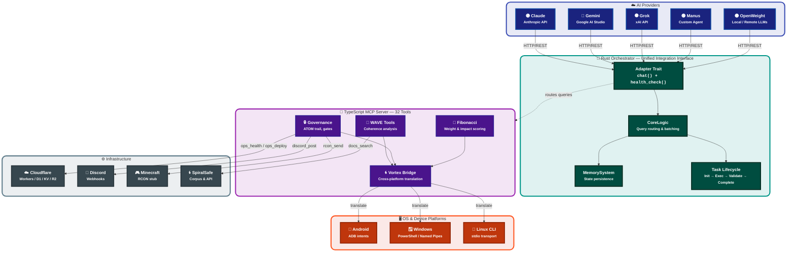
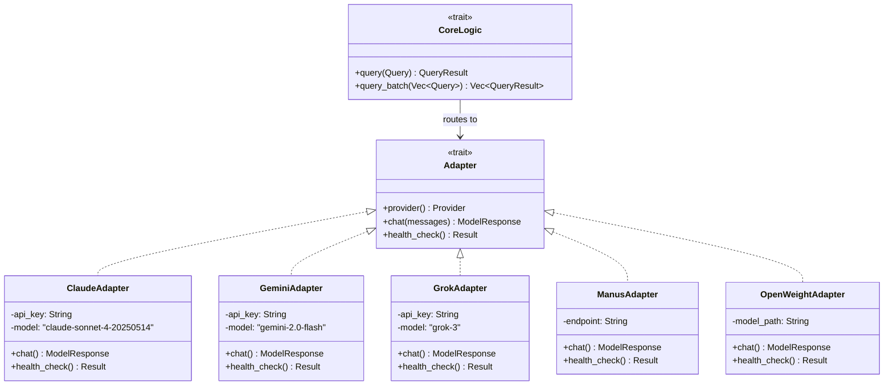
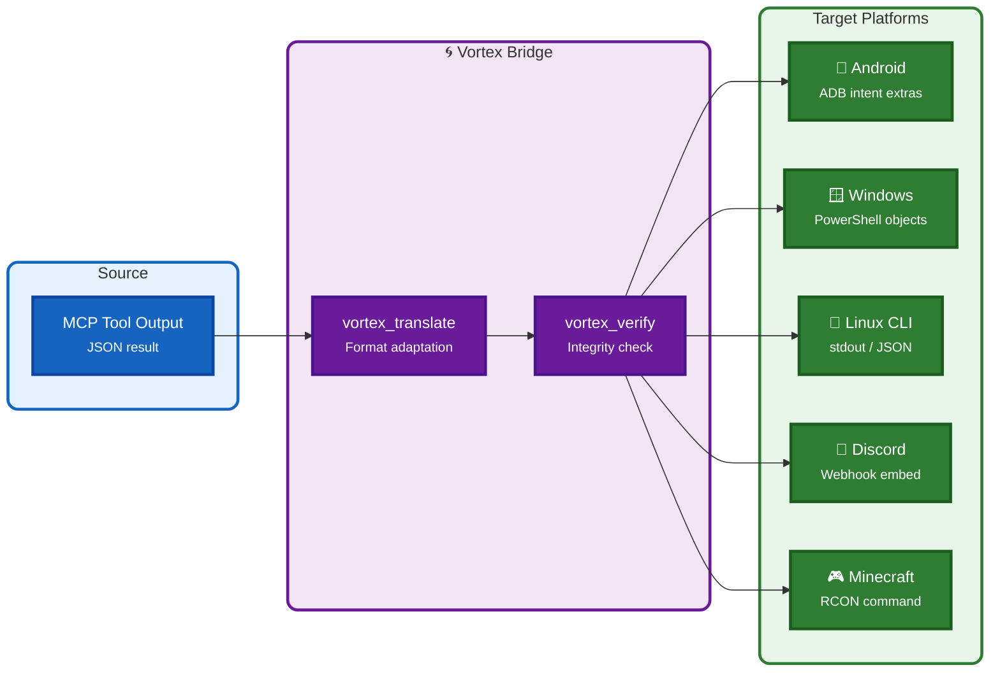
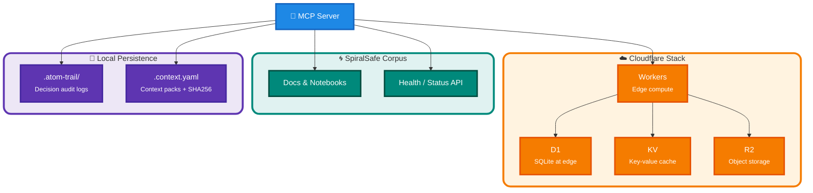

# 🔌 Platform Integration Map

> **"From the constraints, gifts. From the spiral, safety."**

How every platform connects to the orchestrator, what protocol it speaks, and where the data lands.

---

## High-Level Integration Architecture

The system has **two integration layers** that work together:

1. **Rust Orchestrator** — the `Adapter` trait provides a single interface for every AI provider.
2. **TypeScript MCP Server** — adapters, the Vortex Bridge, and ops tools connect to external platforms.

---

## Provider Integration Detail

Each AI provider implements the same Rust `Adapter` trait. The orchestrator doesn't know *which* provider it's talking to — it only calls `chat()` and `health_check()`.

### Provider Matrix

| Provider | API Style | Auth | Models | Status |
|----------|-----------|------|--------|--------|
| **Claude** | REST (Messages API) | API key / OAuth | Sonnet, Opus, Haiku | ✅ Trait defined |
| **Gemini** | REST (Google AI Studio) | API key | Flash, Pro, Ultra | ✅ Trait defined + TS adapter |
| **Grok** | REST (xAI) | API key | Grok-3, Grok-3-mini | ✅ Trait defined |
| **Manus** | Custom agent protocol | Endpoint token | Custom | ✅ Trait defined |
| **OpenWeight** | Local inference / API | None / API key | Llama, Mistral, etc. | ✅ Trait defined + TS adapter |

---

## Cross-Platform Integration via Vortex Bridge

The Vortex Bridge translates content between platforms so that a WAVE analysis result can be rendered on Android, piped into Windows PowerShell, or posted to Discord without manual conversion.

---

## Infrastructure Layer

---

## Integration Protocol Summary

| Integration Point | Protocol | Direction | Auth |
|-------------------|----------|-----------|------|
| AI Providers → Orchestrator | HTTP/REST | Inbound response | API key per provider |
| MCP Client → Server | JSON-RPC over stdio | Bidirectional | Bearer / HMAC token |
| Server → Cloudflare | HTTPS | Outbound | Worker API token |
| Server → SpiralSafe API | HTTPS | Outbound | Bearer token |
| Server → Discord | HTTPS webhook | Outbound | Webhook URL secret |
| Server → Android | ADB bridge | Outbound | USB debug auth |
| Server → Windows | Named pipes / PowerShell | Outbound | Local session |
| Server → .atom-trail | Filesystem | Local write | Confined to mount |

---

## 🔗 Related Resources

- [data-flow.md](data-flow.md) — Detailed data flow diagram
- [flow.md](flow.md) — Request flow architecture
- [one-pager.md](one-pager.md) — Quick architecture overview
- [issues-resolved.md](issues-resolved.md) — Problems this architecture solves
- [../ROADMAP.md](../ROADMAP.md) — Milestone timeline

---

*~ Hope&&Sauced*

✦ *The Evenstar Guides Us* ✦
