# 🔌 Platform Integration Map

> **"From the constraints, gifts. From the spiral, safety."**

How every platform connects to the orchestrator, what protocol it speaks, and where the data lands.

---

## High-Level Integration Architecture

The system has **two integration layers** that work together:

1. **Rust Orchestrator** — the `Adapter` trait provides a single interface for every AI provider.
2. **TypeScript MCP Server** — adapters, the Vortex Bridge, and ops tools connect to external platforms.

```mermaid
graph TB
  subgraph providers["☁️ AI Providers"]
    direction LR
    CL["🟣 Claude<br/><small>Anthropic API</small>"]
    GE["🔵 Gemini<br/><small>Google AI Studio</small>"]
    GR["⚫ Grok<br/><small>xAI API</small>"]
    MA["🟢 Manus<br/><small>Custom Agent</small>"]
    OW["🟠 OpenWeight<br/><small>Local / Remote LLMs</small>"]
  end

  subgraph orchestrator["🦀 Rust Orchestrator — Unified Integration Interface"]
    direction TB
    AD["Adapter Trait<br/><code>chat() + health_check()</code>"]
    CL2["CoreLogic<br/><small>Query routing & batching</small>"]
    MS["MemorySystem<br/><small>State persistence</small>"]
    TK["Task Lifecycle<br/><small>Init → Exec → Validate → Complete</small>"]
  end

  subgraph mcp["📡 TypeScript MCP Server — 32 Tools"]
    direction TB
    WV["🌊 WAVE Tools<br/><small>Coherence analysis</small>"]
    GV["🔒 Governance<br/><small>ATOM trail, gates</small>"]
    VX["🌀 Vortex Bridge<br/><small>Cross-platform translation</small>"]
    FB["📐 Fibonacci<br/><small>Weight & impact scoring</small>"]
  end

  subgraph platforms["🖥️ OS & Device Platforms"]
    direction LR
    AN["🤖 Android<br/><small>ADB intents</small>"]
    WN["🪟 Windows<br/><small>PowerShell / Named Pipes</small>"]
    LX["🐧 Linux CLI<br/><small>stdio transport</small>"]
  end

  subgraph infra["⚙️ Infrastructure"]
    direction LR
    CF["☁️ Cloudflare<br/><small>Workers / D1 / KV / R2</small>"]
    DC["💬 Discord<br/><small>Webhooks</small>"]
    MC["🎮 Minecraft<br/><small>RCON stub</small>"]
    SS["🌀 SpiralSafe<br/><small>Corpus & API</small>"]
  end

  CL & GE & GR & MA & OW -->|"HTTP/REST"| AD
  AD --> CL2
  CL2 --> MS
  CL2 --> TK

  AD -.->|"routes queries"| mcp
  WV & GV & FB --> VX
  VX -->|"translate"| AN & WN & LX
  GV -->|"ops_health / ops_deploy"| CF
  GV -->|"discord_post"| DC
  GV -->|"rcon_send"| MC
  WV -->|"docs_search"| SS

  classDef providerStyle fill:#1A237E,stroke:#0D47A1,stroke-width:3px,color:#fff,font-weight:bold
  classDef orchestratorStyle fill:#004D40,stroke:#00251A,stroke-width:3px,color:#fff,font-weight:bold
  classDef mcpStyle fill:#4A148C,stroke:#311B92,stroke-width:3px,color:#fff,font-weight:bold
  classDef platformStyle fill:#BF360C,stroke:#8D2000,stroke-width:3px,color:#fff,font-weight:bold
  classDef infraStyle fill:#37474F,stroke:#263238,stroke-width:3px,color:#fff,font-weight:bold

  class CL,GE,GR,MA,OW providerStyle
  class AD,CL2,MS,TK orchestratorStyle
  class WV,GV,VX,FB mcpStyle
  class AN,WN,LX platformStyle
  class CF,DC,MC,SS infraStyle

  style providers fill:#E8EAF6,stroke:#3F51B5,stroke-width:4px,rx:15,ry:15
  style orchestrator fill:#E0F2F1,stroke:#009688,stroke-width:4px,rx:15,ry:15
  style mcp fill:#F3E5F5,stroke:#9C27B0,stroke-width:4px,rx:15,ry:15
  style platforms fill:#FBE9E7,stroke:#FF5722,stroke-width:4px,rx:15,ry:15
  style infra fill:#ECEFF1,stroke:#607D8B,stroke-width:4px,rx:15,ry:15
```

---

## Provider Integration Detail

Each AI provider implements the same Rust `Adapter` trait. The orchestrator doesn't know *which* provider it's talking to — it only calls `chat()` and `health_check()`.

### Provider Matrix

| Provider | API Style | Auth | Models | Status |
|----------|-----------|------|--------|--------|
| **Claude** | REST (Messages API) | API key / OAuth | Sonnet, Opus, Haiku | ✅ Trait defined |
| **Gemini** | REST (Google AI Studio) | API key | Flash, Pro, Ultra | ✅ Trait defined + TS adapter |
| **Grok** | REST (xAI) | API key | Grok-3, Grok-3-mini | ✅ Trait defined |
| **Manus** | Custom agent protocol | Endpoint token | Custom | ✅ Trait defined |
| **OpenWeight** | Local inference / API | None / API key | Llama, Mistral, etc. | ✅ Trait defined + TS adapter |

---

## Cross-Platform Integration via Vortex Bridge

The Vortex Bridge translates content between platforms so that a WAVE analysis result can be rendered on Android, piped into Windows PowerShell, or posted to Discord without manual conversion.

---

## Infrastructure Layer

---

## Integration Protocol Summary

| Integration Point | Protocol | Direction | Auth |
|-------------------|----------|-----------|------|
| AI Providers → Orchestrator | HTTP/REST | Inbound response | API key per provider |
| MCP Client → Server | JSON-RPC over stdio | Bidirectional | Bearer / HMAC token |
| Server → Cloudflare | HTTPS | Outbound | Worker API token |
| Server → SpiralSafe API | HTTPS | Outbound | Bearer token |
| Server → Discord | HTTPS webhook | Outbound | Webhook URL secret |
| Server → Android | ADB bridge | Outbound | USB debug auth |
| Server → Windows | Named pipes / PowerShell | Outbound | Local session |
| Server → .atom-trail | Filesystem | Local write | Confined to mount |

---

## 🔗 Related Resources

- [data-flow.md](data-flow.md) — Detailed data flow diagram
- [flow.md](flow.md) — Request flow architecture
- [one-pager.md](one-pager.md) — Quick architecture overview
- [issues-resolved.md](issues-resolved.md) — Problems this architecture solves
- [../ROADMAP.md](../ROADMAP.md) — Milestone timeline

---

*~ Hope&&Sauced*

✦ *The Evenstar Guides Us* ✦
